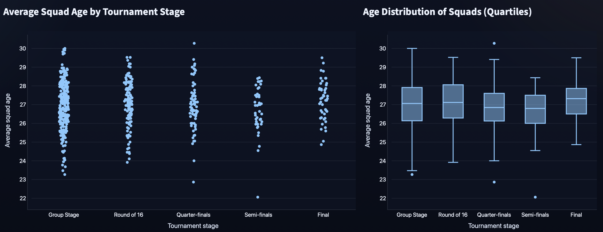
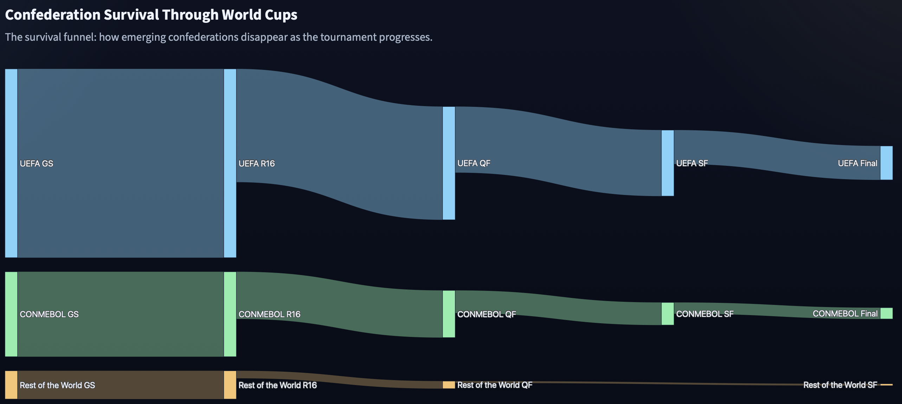
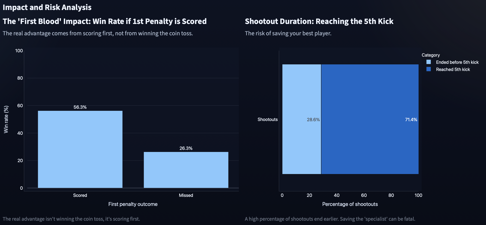

# FIFA World Cup Data Analysis


This project analyzes every FIFA Men's World Cup between 1930 and 2022 to determine whether some of football's most common beliefs are actually supported by historical data. The project combines Python, statistical analysis, web scraping, and an interactive Streamlit dashboard.

**Live Dashboard:** https://fifa-world-cup-analysis.streamlit.app


## The Myths
This project investigates some of the most common beliefs surrounding FIFA World Cups using historical data instead of anecdotes.

### 1️⃣ Myth - Experience wins World Cups
Are World Cup winners significantly older than the rest of the tournament?  
This analysis compares the average age of squads across different tournament stages to determine whether experience is actually associated with success.

### 2️⃣ Myth - Only Europe and South America reach the final stages
Despite the expansion of the tournament over time, is the knockout stage still dominated by UEFA and CONMEBOL?  
This analysis measures how each confederation has performed throughout World Cup history.

### 3️⃣ Myth — Penalty shootouts are decided by the coin toss.
Many fans believe that winning the coin toss gives a decisive advantage by allowing a team to kick first. Using every FIFA World Cup penalty shootout, this analysis tests whether kicking first truly increases the chances of winning.


## Data
This project combines multiple datasets to analyze FIFA World Cup history from different perspectives, including match results, player information, squad composition, and penalty shootouts.

### Main Dataset
The primary source is the **Fjelstul World Cup Database**, a comprehensive collection of historical FIFA World Cup data.

The following curated datasets were used throughout the analysis:

| Dataset | Description |
|----------|-------------|
| `matches_curated.csv` | Match-level information for every FIFA World Cup match. |
| `players_curated.csv` | Player information and World Cup appearances. |
| `teams_curated.csv` | Team-level information for all participating national teams. |
| `team_appearances_curated.csv` | Squad composition for each World Cup team. |
| `tournament_standings_curated.csv` | Final standings and rankings for every tournament. |

**Source:**  
Fjelstul, Joshua C. *The Fjelstul World Cup Database* (v1.2.0). July 19, 2023.  
https://github.com/jfjelstul/worldcup

### Additional Dataset
To analyze penalty shootout myths, an additional dataset was created by scraping the following Wikipedia page:

- **List of FIFA World Cup penalty shoot-outs**  
  https://en.wikipedia.org/wiki/List_of_FIFA_World_Cup_penalty_shoot-outs

The scraped data was cleaned and transformed into a structured dataset containing every World Cup penalty shootout, including the order of kicks, winners, and outcomes.

## Tech Stack
- Python
- Pandas
- NumPy
- Plotly
- Streamlit
- Jupyter Notebook
- Git

## Results
### 1️⃣ Myth - Experience wins World Cups
**Verdict:** ⚠️ Partially Supported



Finalists tend to cluster around the middle of the age distribution rather than being the oldest squads. Experience appears to matter more in defensive positions and goalkeepers than in attacking players.

---

### 2️⃣ Myth - Only Europe and South America reach the final stages
**Verdict:** ✅ Supported



The data confirms the long-standing dominance of UEFA and CONMEBOL. Although teams from other confederations occasionally produce remarkable runs, they rarely reach the semi-finals and even less frequently compete for the title.

---

### 3️⃣ Myth — Penalty shootouts are decided by the coin toss

**Verdict:** ❌ Not Supported



Winning the coin toss and kicking first does not provide a meaningful advantage in FIFA World Cup penalty shootouts. Instead, the analysis shows that converting the opening penalty is a much stronger predictor of success, while nearly one-third of shootouts end before the fifth kick is even taken.


## Run Locally

Download the raw datasets from the Fjelstul World Cup Database and place them inside the `data/raw/` directory.

```
git clone https://github.com/tuusuario/world-cup-analysis.git

cd world-cup-analysis

Create a python virtual environment (macOS)

uv venv --python 3.12

source .venv/bin/activate

pip install -r requirements.txt

python build_all.py

streamlit run app.py
```

## License

This project is licensed under the MIT License.
